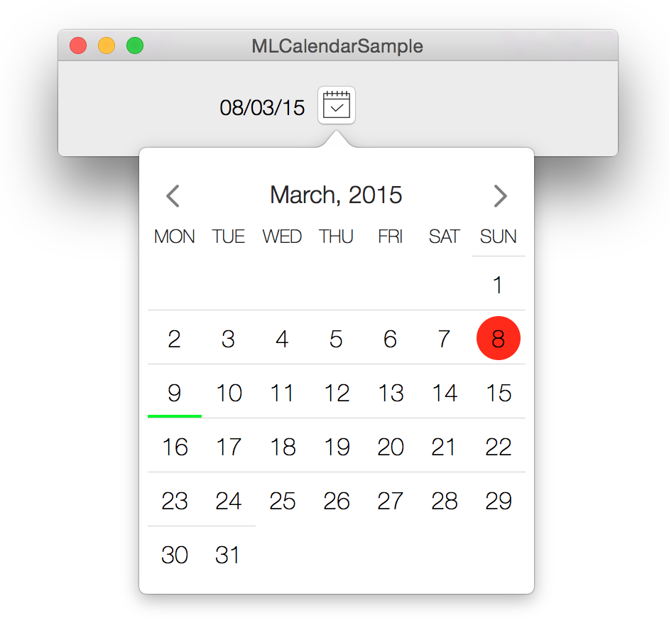

# Calendar-OSX

Calendar component for OSX inspired by some free iOS calendar
<p align="center">
	
	<p align="center">
		<em>MLCalendarView in NSPopover</em>
	</p>
</p>

#Description

MLCalendarView is a date selector component which is represented as a month calendar. This component extracted from the [ModerLook-OSX](https://github.com/gyetvan-andras/ModernLook-OSX) package for easier standalone use.

The component uses the system Language & Region settings, so it will display the month and day names regarding to the system settings. Also it lays out the days according to the first day of week system setting.

#Usage
To use the component in your project you need to copy all the files in the MLCalendar group to your project.

MLCalendarView is derived from NSViewController and can be used as any other view. 

The component contains the following properties to change the default colors used by the calendar.
```objective-c
@property (nonatomic, copy) NSColor* backgroundColor;
@property (nonatomic, copy) NSColor* textColor;
@property (nonatomic, copy) NSColor* selectionColor;
@property (nonatomic, copy) NSColor* todayMarkerColor;
@property (nonatomic, copy) NSColor* dayMarkerColor;
```
And the following two properties to set the selected date and the currently displayed month.
```objective-c
@property (nonatomic, strong) NSDate* date;
@property (nonatomic, strong) NSDate* selectedDate;
```
Also, there is a delegate for the calendar, which is used to send a message when the selected date changed.
```objective-c
@protocol MLCalendarViewDelegate <NSObject>
- (void) didSelectDate:(NSDate*)selectedDate;
@end
```

#Sample Application
The sample application shows the usage of the component as an NSPopover content.

#License
MIT
